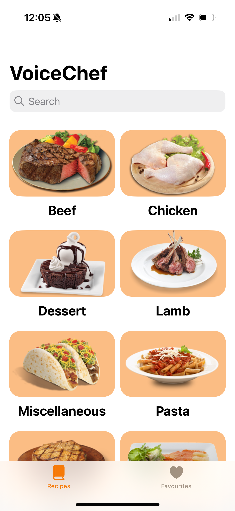
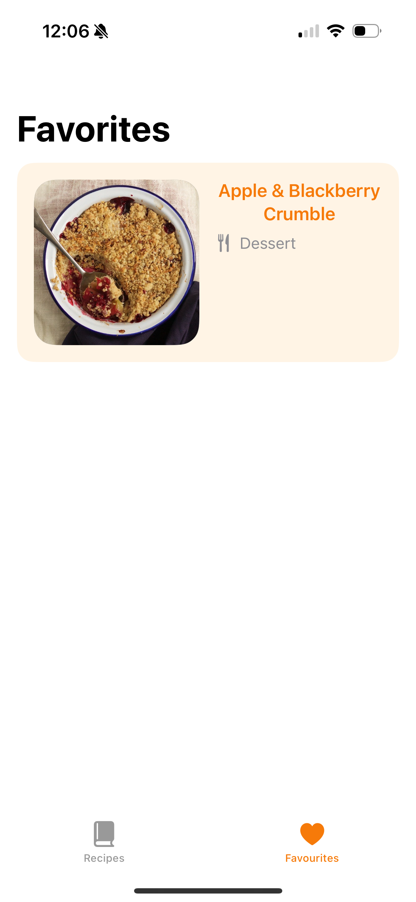

# My beautiful Xcode Project 👩🏽‍🍳

## VoiceChef
VoiceChef is an app that brings recipes to life with hands-free functionality. Designed for accessibility and convenience, VoiceChef allows users to cook effortlessly with the help of voice-over features and a speech synthesizer.

## ScreenShot




## Features 
- **Categorized Recipe List**: Browse recipes organized by categories for easy discovery.
- **Favorites List**: Save your favorite recipes for quick access anytime.
- **Voice-Over Support**: Navigate the app with ease using voice-over features implemented across the app.
- **Speech Synthesizer**: Listen to ingredients and step-by-step instructions while cooking, keeping your hands free and your focus on the recipe.

## Installation
1. Clone the repository:
   ```bash
   git clone https://github.com/yourusername/voicechef.git
   ```
2. Navigate to the project directory:
   ```bash
   cd voicechef
   ```
3. Install dependencies:
   ```bash
   npm install
   ```
4. Start the application:
   ```bash
   npm start
   ```
   
## Usage
1. Open the app and explore the list of recipes organized by category.
2. Select a recipe to view the ingredients and step-by-step instructions.
3. Enable the speech synthesizer to listen to the recipe while you cook.
4. Save recipes you love to your favorites list for future reference.

## License 
All rights reserved.


